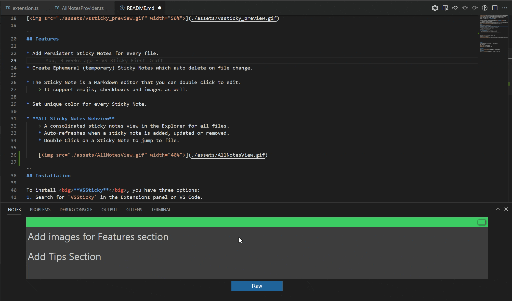
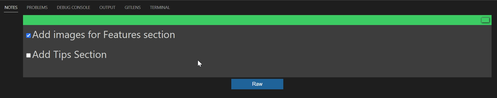
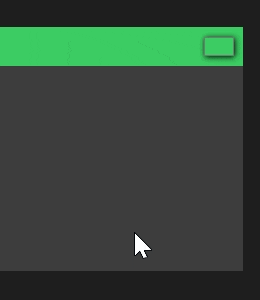
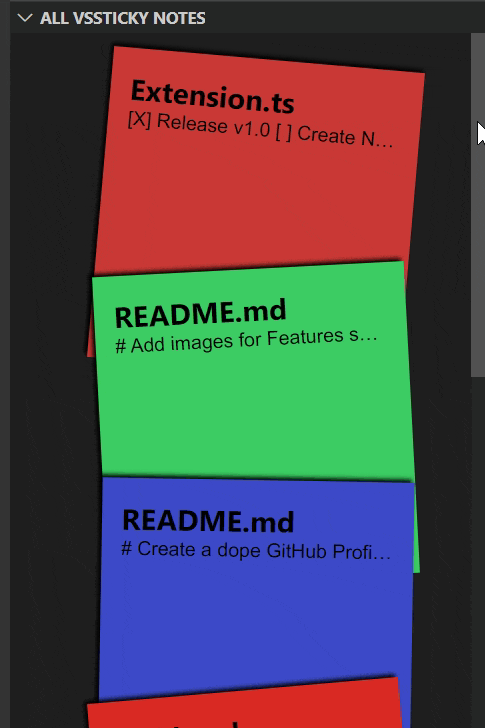
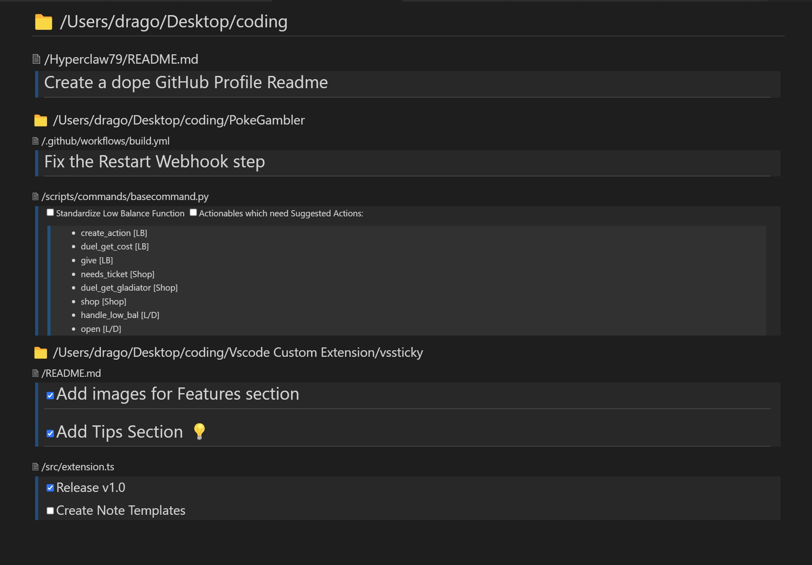
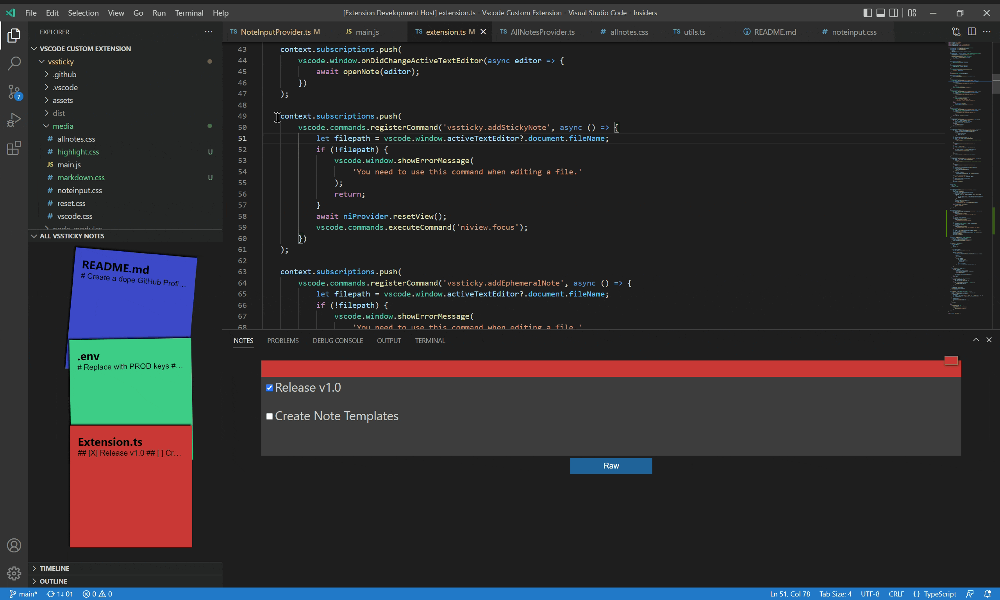

# VSSticky - The Last Sticky Notes Extension You'll Need.

It's pretty common to keep getting newer ideas or an annoying bug that you need to fix later.\
So you'd want to write them down somewhere.\
What better way to do that than to use **Sticky Notes** right?! \
Now you don't need to maintain them externally, with <big>**VSSticky**</big>, you can attach sticky notes from within VSCode!

## Why VSSticky? 📝
There are tons of sticky notes extensions out there, but what makes <big>**VSSticky**</big> different?\
<big>**VSSticky**</big> is a first of a kind extension that offers isolated sticky notes.\
You can have `seperate sticky notes for every file`.
> You can focus better on the task at hand.\
> No more the need for scavenging through a bunch of sticky notes to find the one that you had planned for a particular file.

## Features 📖

* **Notes Panel**
    * Add Persistent Sticky Notes for every file.

        

    * Create Ephemeral (temporary) Sticky Notes which auto-delete on file change.

        

    * The Sticky Note is a Markdown editor that you can double click to edit.
        > It support emojis, checkboxes and images as well.

        

    * Set unique color for every Sticky Note.

        

* **All Sticky Notes Webview**
    > A consolidated sticky notes view in the Explorer for all files.
    * Auto-refreshes when a sticky note is added, updated or removed.
    * Double Click on a Sticky Note to jump to file.

    

* **TODO List**
    > A consolidated TODO list containing all your sticky notes in a single Markdown preview.
    * The list is sorted in a tree-like manner.

    

* **Copy Sticky Note as Codeblock**
    > Right click on a selection of text to copy as codeblock to the active sticky note.

    

## Installation 🛠

To install <big>**VSSticky**</big>, you have three options:
1. Search for `VSSticky` in the Extensions panel on VS Code.
2. Open VSCode Quickbar using <kbd>Ctrl</kbd> + <kbd>P</kbd> and run the command `ext install Hyperclaw79.vssticky`.
3. Install it from the Marketplace:\

## Extension Settings ⚙

<big>**VSSticky**</big> exposes one User Setting:

* `vssticky.autosaveInterval`: This is the time in milliseconds between each autosave for a sticky note. Defaults to `500`.

## Commands 🤖

Following are the commands that you can use in the VSCode context menu.

Command | Description
:---: | :---
`Add Sticky Note` | Add a new sticky note.
`Delete Sticky Note` | Remove the selected sticky note.
`Add Ephemeral Note` | Add a new ephemeral note.
`Delete All Notes` | Delete all created Sticky Notes.
`Import Sticky Notes` | Import sticky notes from a JSON file.
`Export Sticky Notes` | Export sticky notes to a JSON file.
`Create Todo` | Create a TODO list from all the sticky notes.
`Copy Selection to Existing Note` | Copy the selected text to the active sticky note.

## Tips 💡

1. Use colors to group your sticky notes. For e.g., by Project, Bugs/Features, etc.
2. Double click on a sticky note to quickly jump to the file.
3. Check out the [Markdown Cheat Sheet](https://www.markdownguide.org/cheat-sheet/).

## Contribution 💬

Please read the [Contribution Guide](./CONTRIBUTING.md) to help improve VSSticky.

## Release Notes 📰

Please read the [release notes](./CHANGELOG.md) to learn about the latest changes.
